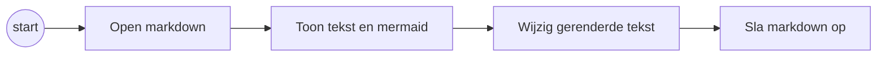

# Demo-document

Dit is een **vet** voorbeeld met een [link](https://example.com).

## Lijsten

- Eerste punt
- Tweede punt

1. Een
2. Twee

### Stroomdiagram

```mermaid
flowchart LR
  start((start)) --> open[Open markdown]
  open --> render[Toon tekst en mermaid]
  render --> edit[Wijzig gerenderde tekst]
  edit --> save[Sla markdown op]
```
