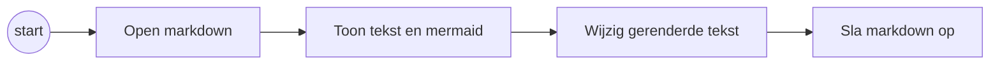
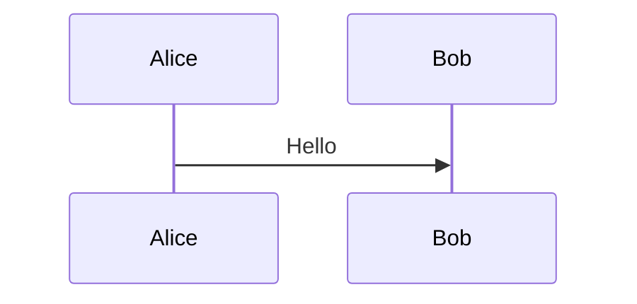
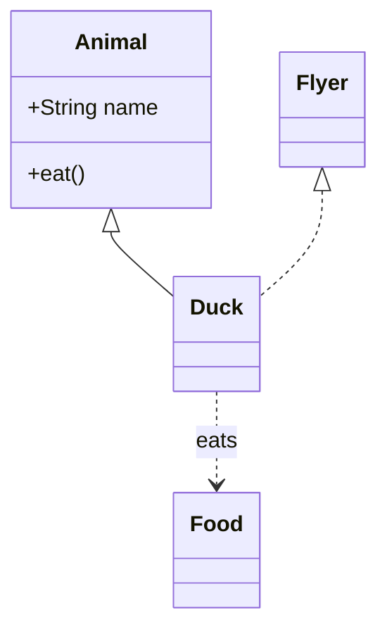
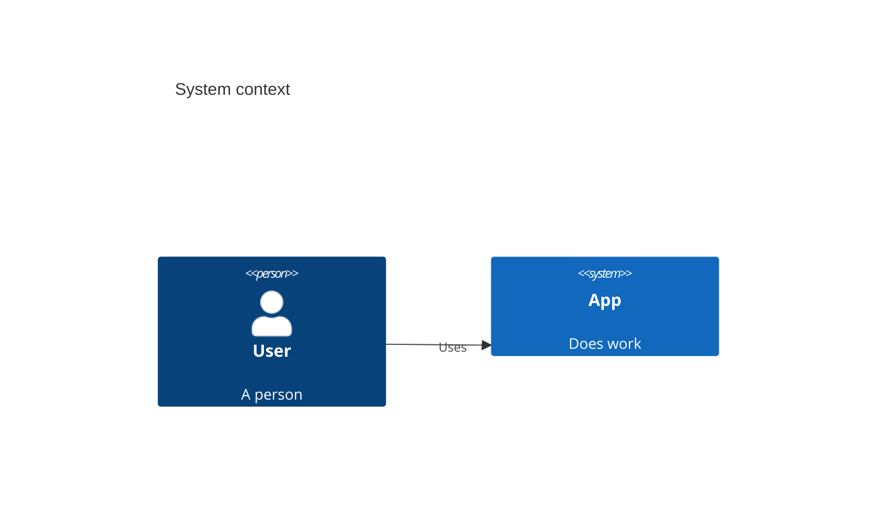

# Demo-document

Dit is een **vet** voorbeeld met een [externe link](https://example.com).

---

## Lijsten

- Eerste punt
- Tweede punt

1. Een
2. Twee

## Taken

- [ ] Nog doen
- [x] Afgevinkt

Open het [gekoppelde document](linked.md).

### Stroomdiagram

Dubbelklik het diagram om nodes en pijlen te bewerken.

### Sequencediagram

### Klassendiagram

### C4 Context

